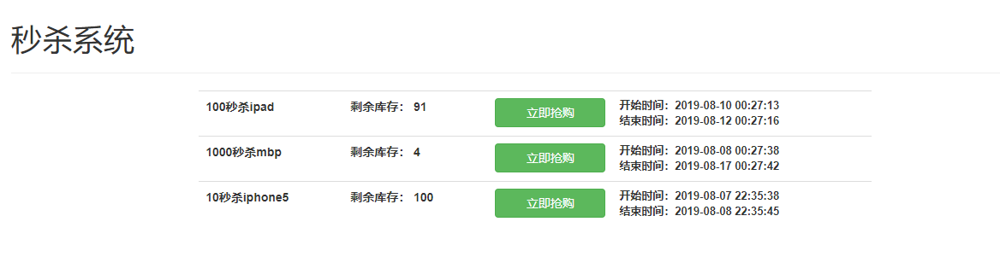
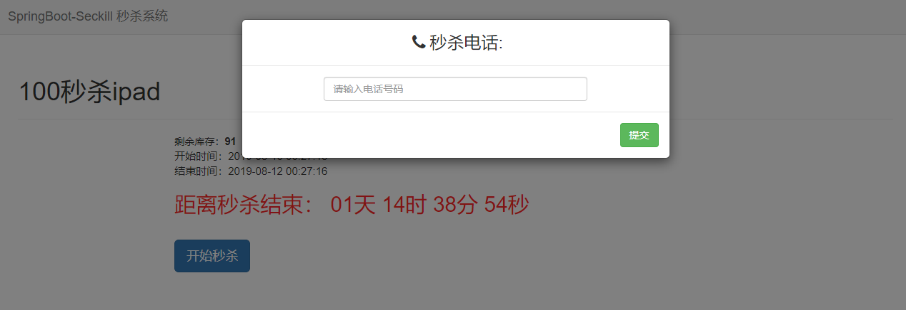
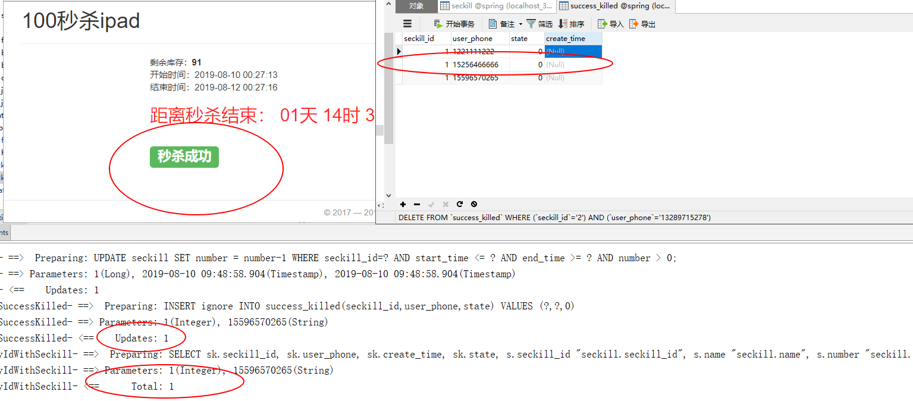

## SpringBoot 秒杀项目

### **技术栈**

- 后端： SpringBoot-2.x + Redis-4.x 
- 前端： Bootstrap + Jquery

### **测试环境**

- IDEA + Maven 3.5.4 + Tomcat8 + JDK8

### 开发环境

- 语言： JDK 1.8

- IDE： IDEA 2019.2

- 依赖管理： Maven

- 数据库： Mysql 5.7

### **启动说明**

  - 启动前，请配置好 `application.properties` 中连接数据库的用户名和密码，以及Redis服务器的地址和端口信息。
  - 启动前，请创建数据库`seckill`，建表SQL语句放在：SQL文件夹中。具体的建表和建库语句请仔细看SQL文件。
  - 创建好数据库之后，请执行 SQL 文件夹中的 seckill-transaction.sql 中的存储过程，然后直接进行下面的操作。也可以将 `service.impl.SeckillServiceImpl` 中的144-174 行注释，
    再将 `controller.SeckillController` 89 行开启注释，关闭90 行的注释，这样也可以正常运行项目。
  - 配置完成后，运行位于 `src\main\java\com\example\demo3`下的SpringbootSeckillApplication中的main方法，访问 `http://localhost:8080/seckill/list` 进行API测试。
  - 注意数据库的sql 数据需要自己添加。

**仓库地址：**https://github.com/wannengdek/SpringBoot-Seckill
**欢迎star、fork，给作者一些鼓励** https://github.com/wannengdek

### 开发过程

总体分为四个模块，具体开发过程请看我的博客：

[SpringBoot秒杀系统（一）Dao 层](https://blog.csdn.net/qq_41852212/article/details/98884976)

[SpringBoot秒杀系统（二）Service层](https://blog.csdn.net/qq_41852212/article/details/98954619)

[SpringBoot秒杀系统（三）web 层](https://blog.csdn.net/qq_41852212/article/details/99111102) 

[Spring Boot秒杀系统（四）高并发优化](https://blog.csdn.net/qq_41852212/article/details/99111443)

### 项目预览

#### 主页面

#### 商品详情页面 （未登录）

#### 点击秒杀之后

#### 再次秒杀

没有错误数据产生，并且也提示了用户重复秒杀的问题。